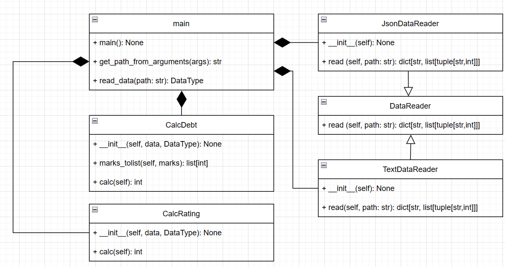

# Лабораторная работа 1 по дисциплине "Технологии программирования"
Вариант 4:
  Формат входного файла - JSON;
  Расчетная процедура - Рассчитать и вывести на экран количество студентов, 
                        имеющих академические задолженности (имеющих балл 
                        < 61 хотя бы по одному предмету).
Диаграмма классов:

Вывод: в результате выполнения лабораторной работы были освоены навыки работы с системой git.
